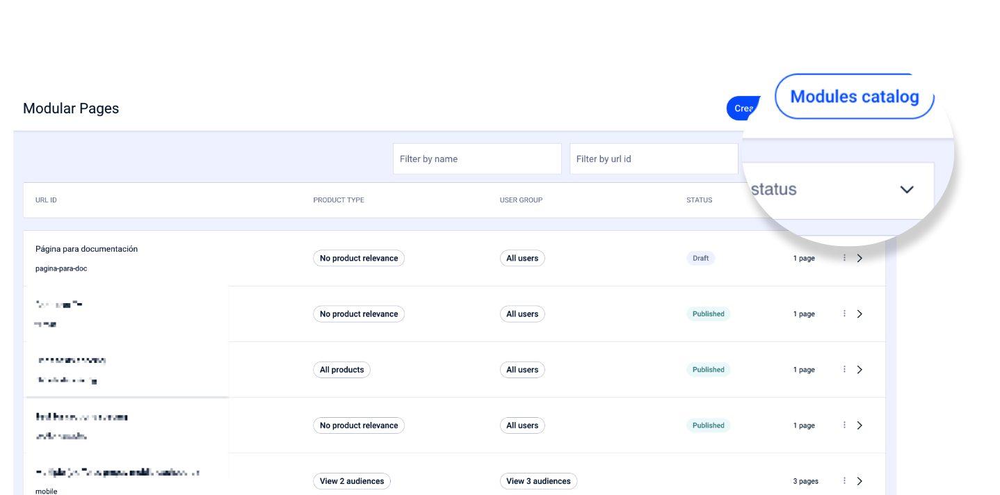
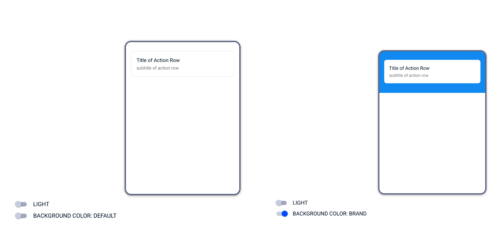

# Catálogo de módulos disponíveis

Na página principal do Modular Pages CMS, você tem acesso direto ao catálogo de módulos disponíveis.

Clique em **Module Catalog** para acessar o catálogo completo.

<figure><figcaption></figcaption></figure>

No catálogo de módulos, você tem acesso a todos os módulos disponíveis para criar suas páginas modulares.

No lado **esquerdo**, você tem a **lista de todos os módulos disponíveis** e no lado **direito** uma **pré-visualização** desse módulo.

## Informações sobre cada módulo

<figure><figcaption></figcaption></figure>

1. **Nome** do módulo

2. **Visual**: nome do visual

3. **Stereotype**: nome do estereótipo ao qual pertence. Esta informação é muito útil para perfis de desenvolvimento.

4. Menu adicional com acesso a:

    - **See usages**. Clique para ver em quais páginas este módulo está sendo usado
    - **Filter modules like this**: Exibe módulos que, apesar de serem visualmente diferentes, utilizam o mesmo estereótipo.
    - Se o módulo possuir um editor, o nome desse editor aparece e permite acessá-lo diretamente.   👋🏽 Exemplos de editores: Entry point list, Explore, Alerts, Extras, Start tab header.

5. **Pré-visualização do módulo**. Você pode ver uma pré-visualização de como será o módulo, para ter uma ideia e saber rapidamente se ele é útil para você.

6. **Light/Dark**. Use esta opção para alternar entre o modo normal e o modo escuro. Isso permite que você faça uma pré-visualização a aparência do módulo quando o usuário o visualiza no modo normal ou no modo escuro ou noturno.

7. **Background color: Default/ Background color**. Use esta opção para ver a aparência do módulo em uma seção com fundo Default ou com cor de fundo Brand.    \

    <figure><figcaption></figcaption></figure>

8. **Presets**. Esta opção aparece apenas se o módulo possuir diferentes tipos de visualizações pré-configuradas. Caso as possua, é indicada a quantidade de visualizações diferentes e ao acessar os detalhes desse módulo, clicando na linha correspondente, é mostrado um menu suspenso com as diferentes opções.   🧐 Observe como a pré-visualização do lado direito muda dependendo do **Preset** selecionado.  \
