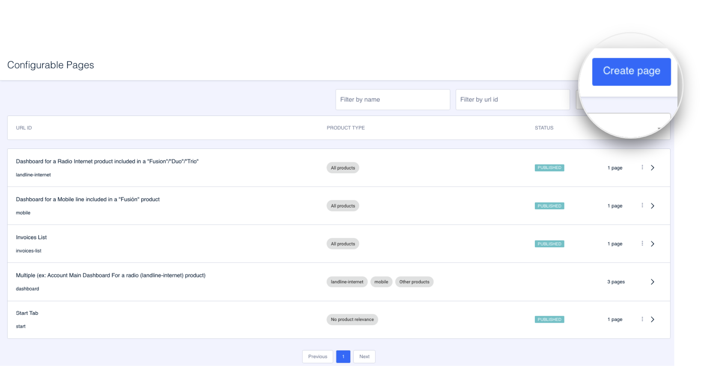

# Como criar uma página modular

Clique em **Create page** para criar uma nova página.

O processo de criação de uma página modular é dividido em várias etapas:

**Etapa 1. Overview**. Nesta etapa são configuradas as informações gerais da página (nome interno, ID, tipo de página, etc.)


[overview.md](overview.md)


**Etapa 2. Content**. Aqui você configura a aparência da página. É o lugar onde os módulos são adicionados e é decidida a ordem que eles terão na página, entre outras coisas.


[contenido.md](contenido.md)


**Etapa 3. Preview**. A última etapa, a título de resumo, e a partir da qual você também pode [criar um teste](../como-probar-el-contenido.md) para validar a configuração da página antes de impactar uma grande massa de clientes.


[vista-previa.md](vista-previa.md)


