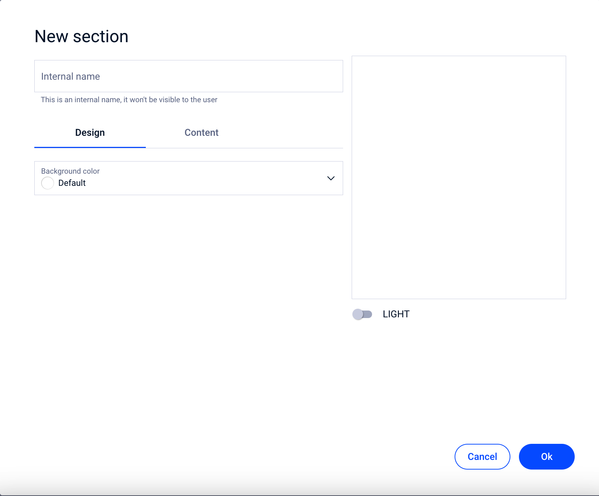
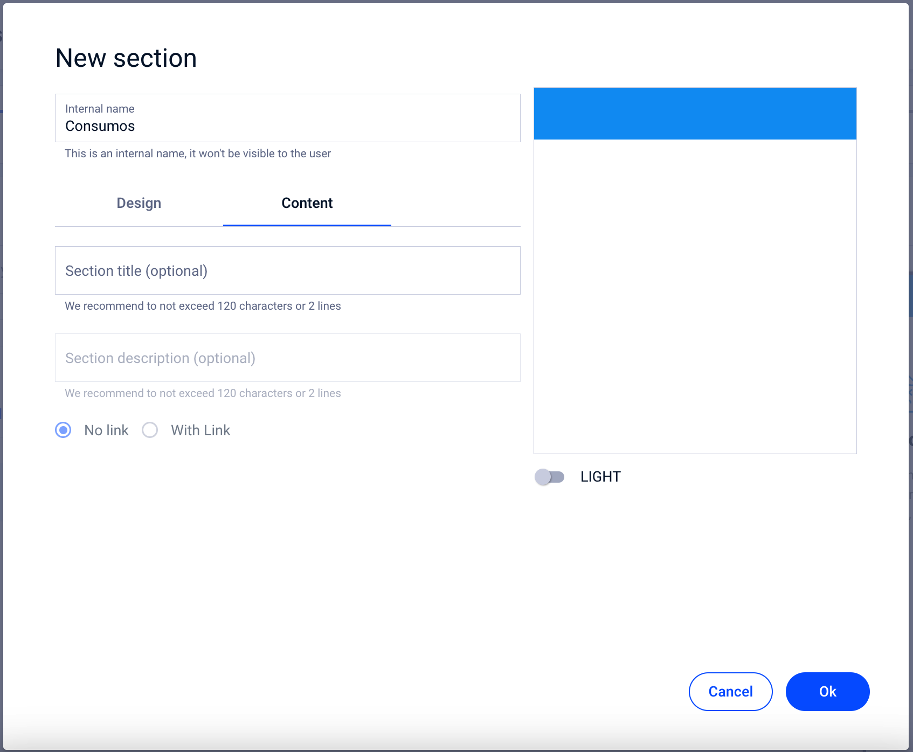
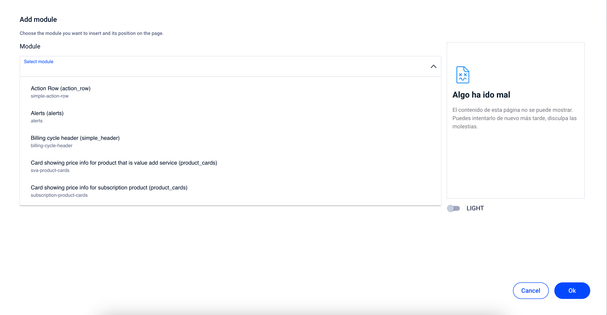
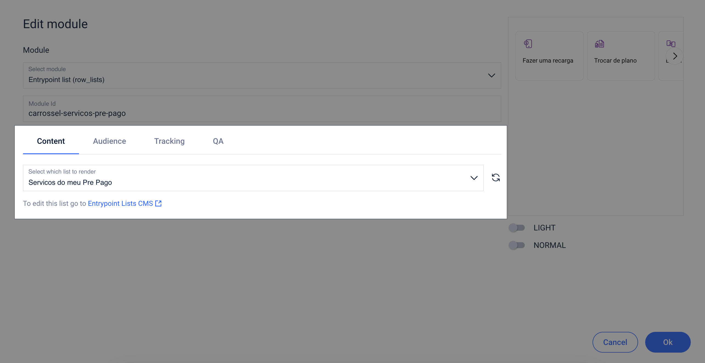
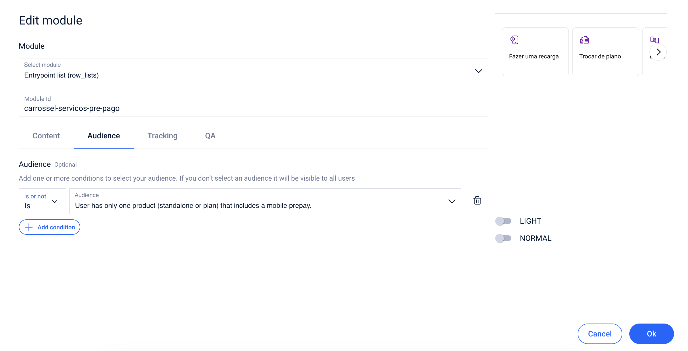
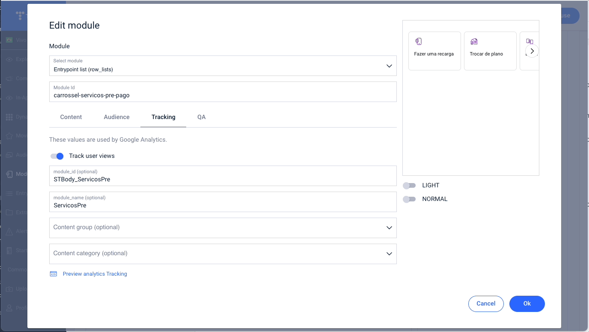
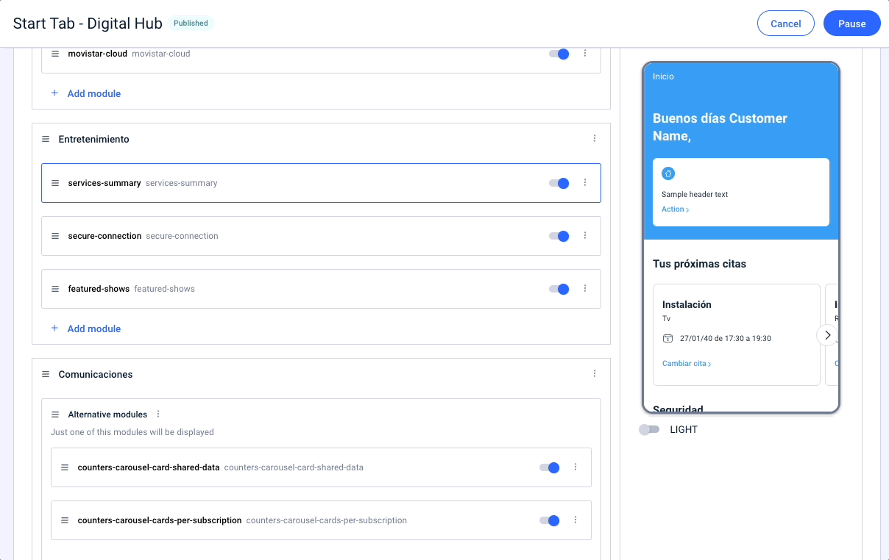
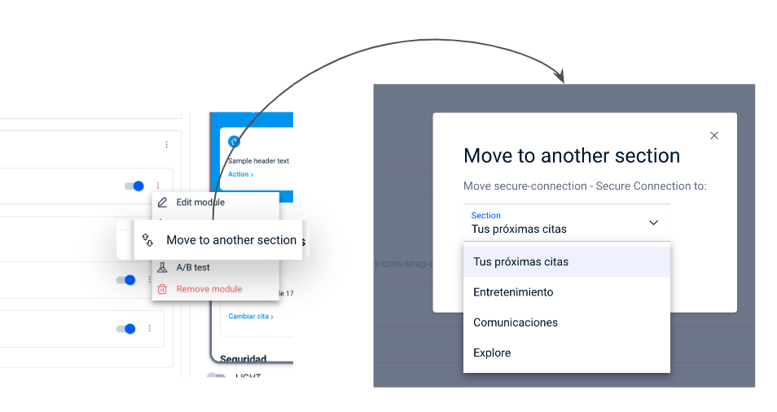
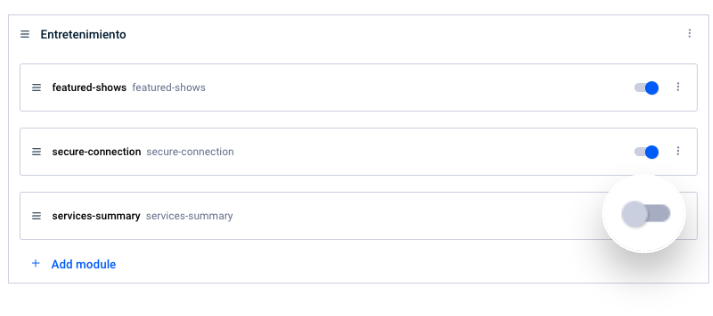

# Conteúdo

O conteúdo de uma página modular é configurado através da inserção de módulos, a escolha da ordem desses módulos dentro da página, bem como a configuração das seções que os contêm.

Esta etapa é dividida em duas partes:

* Na parte **esquerda** estão os **módulos organizados** como você deseja que sejam vistos no app.
* Na parte **direita** uma **pré-visualização** , o mais fiel possível, do que o usuário do app verá.


É importante que você tenha em mente que, além do que você vê na visualização à direita, os módulos podem ser configurados para serem exibidos aos usuários com base em uma série de premissas, entre outras, os públicos. Portanto, o que você vê nessa pré-visualização não precisa ser exatamente como o usuário vê.

Se quiser ver exatamente como um usuário específico visualiza uma página modular, você pode fazer um [Teste](../como-probar-el-contenido.md).


Além disso, a página está dividida em duas partes: com uma seção **Header** , que você sempre verá ao criar uma nova página, e o resto da página que pode conter uma ou mais seções, dependendo de como deseja organizar o conteúdo.

## Como criar uma seção

Para criar uma nova seção, clique em **+New section**. Preencha os campos necessários no modal que se abre.

<figure><figcaption></figcaption></figure>

**Internal name** . Este campo é de uso interno e serve para que você possa identificar e diferenciar corretamente cada seção da página modular. É um campo obrigatório.

💡Tente deixar o nome o mais descritivo possível, pois isto ajudará a saber que tipo de módulos e quais informações estão contidas na seção.

### Design

Nesta aba, indique a cor de fundo da seção. Use o menu suspenso **Background color**.

### Content

Nesta aba, configure os campos da seção que o usuário do app verá.

<figure><figcaption></figcaption></figure>

* **Section title (opcional)**. Indica o título da seção que o usuário do app verá quando for exibida a página modular que você está criando ou editando. É um campo opcional e, portanto, não será visto se você não indicar um valor.


Uma seção pode ou não ter um título de seção. Da mesma forma, o conteúdo (módulos) da seção será visto sempre que correspondam ao usuário.


* **Section description (opcional)**. Indica uma descrição do conteúdo da seção. Essa descrição será vista pelo usuário do app. É um campo opcional.
* **No link**. Opção selecionada por padrão. Indica que a seção não conterá um link.
* **With link**. Selecione esta opção para adicionar um link à seção.
  * **Link text action**. Indica o texto do link.
  * **Select type URL**:
    * **URL**. Selecione esta opção para preencher manualmente o seguinte campo **de URL** .
    * **Preconfigured**. Selecione esta opção para selecionar um dos URLs preconfigurados no campo URL.

<figure><figcaption></figcaption></figure>


**Por que não vejo a seção que acabei de configurar na pré-visualização?**

Até que uma seção contenha pelo menos um módulo, essa seção não estará visível na pré-visualização da página modular que você está criando ou editando.

É exatamente esse o comportamento de uma página modular para os usuários do app. Se uma seção tiver módulos, mas nenhum se aplicar a esse usuário, então essa seção não será exibida, mesmo que tenha módulos dentro e contenha um título de seção, descrição e/ou link.


## Como adicionar um módulo

Os módulos sempre estarão dentro de uma seção e, portanto,, antes de adicionar um módulo, você deve [criar pelo menos uma seção](contenido.md#como-crear-una-seccion). Se o que você precisa é incluir um módulo no **Header**, essa seção é sempre criada por padrão.

Clique em **+Add module** na seção onde deseja incluir um módulo.

* **Select module**. Selecione o módulo que vai ser adicionado.
* **Module ID**. O sistema oferece, dependendo do módulo selecionado, um ID para identificar exclusivamente o módulo que você está adicionando. Você pode alterar o ID do módulo, desde que use um nome que ainda não esteja em uso.

<figure><figcaption></figcaption></figure>

Consulte o Catálogo de módulos disponíveis no próprio CMS. Na tela principal, clique em **Module catalog**.

Você precisa de mais informações sobre como consultar o **Catálogo de Módulos**? 👇🏼


[catalogo-de-modulos-disponibles.md](../catalogo-de-modulos-disponibles.md)


### Estrutura de edição de um módulo

Dependendo do módulo adicionado, serão exibidos os campos que permitem configurações adicionais no CMS. Para ajudar, esses campos estão divididos em abas de acordo com sua tipologia:

#### Content

Todos os campos relacionados ao conteúdo do módulo estão disponíveis nesta aba.


Lembre-se de que esses campos variam para cada tipo de módulo adicionado. Alguns módulos permitem maior configurabilidade do que outros 😉.


Se o módulo que você incluir tiver um CMS específico, você obterá um link direto para acessar a edição do elemento.

<figure><figcaption></figcaption></figure>

Se você fizer alterações no módulo, será necessário atualizar o elemento para que a pré-visualização fique mais fiel. Clique em  para realizar esta atualização de informações.


🚨 Este guia do usuário não detalha cada campo que pode ser editado em um determinado módulo, pois isto depende do conteúdo adicionado.


#### Audience

Nesta aba configure, se necessário, os públicos que deverão ver o módulo que você está criando.

Você pode usar o compositor de público para definir as condições que o usuário deve atender para ser elegível para visualizar o módulo.

<figure><figcaption></figcaption></figure>

Clique em **+Add condition** para adicionar uma nova condição.

* Selecione **Is** no menu suspenso para indicar que cumpra com o público.
* Selecione **Is Not** para indicar que não cumpra com o público.
* No menu suspenso **Audiencia**, selecione o público apropriado.


Se você não selecionar **nenhuma audiencia**, entende-se que o módulo estará visível para **todos os usuários**.


#### Tracking

Nesta aba, você pode configurar os campos de tracking necessários. Atualmente, muitos dos campos são rastreados automaticamente, mas estes são os campos que você pode adicionar:

* **module\_id (opcional)**. Campo de texto aberto relacionado ao ID do módulo e que atende ao tracking do Universal Analytics\*.
* **module\_name (opcional)**. Campo de texto aberto relacionado ao nome do módulo e que atende ao tracking do Universal Analytics\*.

\*_Campo que se tornará obsoleto quando o Universal Analytics desaparecer._

* **Content group (opcional)**. Selecione um dos disponíveis no menu suspenso.
* **Content\_category (opcional)**. Dependendo do valor que você selecionou no menu suspenso **Content\_group**, os valores que você pode selecionar para **Content\_category** são limitados.

**Analytics tracking preview**. Utilize esta opção para conhecer o tracking dos elementos e seus valores padrão. Clique na pré-visualização do módulo sobre os elementos cujo tracking você deseja conhecer.

<figure><figcaption></figcaption></figure>

Clique em **x Closing preview** para deixar de ver essas informações e poder navegar para outras abas no modo de edição.

#### QA

Aba dedicada a poder indicar um ID específico do módulo a ser utilizado nos testes automáticos ou manuais da equipe de QA.

**Testing ID (opcional)**. A equipe de teste utiliza este campo para verificar as informações exibidas na tela.

Geralmente, você não precisa preencher este campo 🤓.

Clique em **OK** no modo de criação/edição do módulo quando tiver preenchido todos os campos necessários.


**IMPORTANTE**: lembre-se de que as alterações não são salvas até chegar à última etapa, onde você pode publicar as alterações ou salvá-las.

Se você fechar a tela nesse momento, perderá todas as configurações feitas.


***

## Ações comuns ao criar/editar uma página

Antes de detalhar quais ações comuns você pode realizar dentro de uma página modular, lembre-se de que você sempre tem ações secundárias, tanto na seção quanto no módulo.

Clique em  para abrir o menu secundário.

<figure><figcaption></figcaption></figure>

### Mover um módulo dentro de uma seção

Use a opção _Drag\&Drop_ para mover o módulo para a posição desejada.

<figure><figcaption></figcaption></figure>

### Mover um módulo para outra seção

Use a opção _Drag\&Drop_ para mover o módulo para a posição desejada. Você também tem o menu secundário **Move to another section**. Um modo é aberto para indicar a qual seção deseja movê-lo. Clique em **Move module** para confirmar a mudança para a seção que você indicou. O módulo é colocado em último lugar nessa seção.

<figure><figcaption></figcaption></figure>

### Desativar/Ativar um módulo

A desativação de um módulo permite que você não o torne visível para os usuários do app, enquanto esse módulo estiver desativado. Da mesma forma, ativá-lo o tornará visível novamente.

😉 Lembre-se de que quando você desativa um módulo ele não é visto na preview do lado direito.

Desativar um módulo é uma ação menos destrutiva do que excluí-lo, pois nesse caso, para recuperá-lo, seria necessário adicioná-lo novamente e configurá-lo do zero.

Use a chave ao lado do módulo para ativar/desativar:

<figure><figcaption></figcaption></figure>

### Criar um grupo de módulos alternativos

Há casos em que, dependendo do público dos usuários, é necessário que um módulo seja exibido em determinado ponto do app para alguns usuários ou um módulo diferente para os demais. A maneira de fazer isso é através de módulos alternativos. Esses módulos funcionam como um só, isto é, vários são configurados mas apenas um é exibido no app, aquele que se aplica ao usuário.

Tenha em mente que a ordem em que os módulos alternativos são listados é importante, pois o sistema avalia, de cima para baixo, o primeiro módulo que corresponde ao usuário. Esse será o módulo que será exibido.

<figure><figcaption>
Exemplo de módulos alternativos
</figcaption></figure>

#### Como criar um grupo de módulos alternativos

A primeira coisa é já ter um dos módulos colocado em uma seção. Em seguida, clique no menu secundário desse módulo e selecione **+Add alternative** .

<figure><figcaption></figcaption></figure>

Configure o novo módulo alternativo desejado. Você pode repetir a operação quantas vezes quanto módulos alternativos forem necessários.


Tenha em mente que apenas um módulo não pode conter público e você deve colocar esse módulo na última posição, caso contrário, a condição do restante dos módulos nunca seria avaliada.


### Criar um teste A/B

A partir de páginas modulares, é possível realizar um teste A/B para testar como funciona uma mudança em um módulo.

Aqui você tem todas as informações necessárias 👇🏼


[como-hacer-un-test-a-b.md](../como-hacer-un-test-a-b.md)


***

Ao finalizar a configuração de todo o conteúdo da página, clique em **Continue** para ir para a próxima etapa.


Lembre-se de que as alterações não são salvas automaticamente e que você precisa ir para a última etapa para salvar ou publicar as alterações. 🤓

