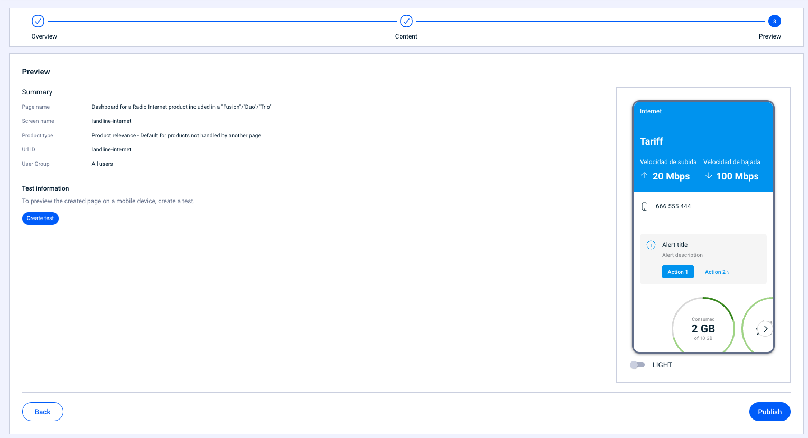
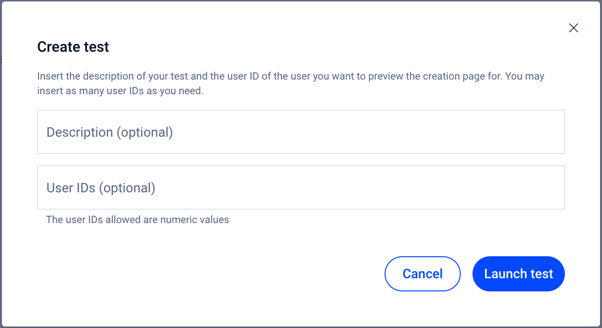

# Vista previa

En este último paso dispones de un resumen de la página modular que has configurado.

Además, es desde este paso desde donde puedes iniciar un test para probar el contenido antes de impactar a los usuarios.

<figure><figcaption></figcaption></figure>

Este paso te da información sobre:

* **Page name**. Título interno de la página modular. Este título no es el que se muestra a los usuarios sino que es el nombre interno que has indicado en el paso **1 Overview**.
* **Screen name**: Valor por defecto que toma la página modular en función del **Page name** que hayas indicado en el paso **1 Overview**. Este campo es usado para realizar el tracking de la página modular.
* **Product type:** Indica el tipo de página modular que has creado. Recuerda que el contenido de la página puede depender de información o productos del usuario o puede estar relacionada con un producto o paquete de productos (**User related** o **Product related**).
* **Url ID**. ID de la página modular que estás creando o editando.
* **User Group**. Indica si la página está configurada para un determinado grupo de usuarios. En caso de no estarlo el valor será _All users_.

Haz clic en **Save** para guardar los campos o haz clic en **Save and publish** para guardar y publicar los cambios.

### Cómo crear un test

Desde este último paso puedes también crear un test para probar el contenido que has configurado antes de impactar a una amplia masa de usuarios.

#### Test information

Haz clic en **Create test** para comenzar un test.&#x20;

<figure><figcaption></figcaption></figure>

* **Description (optional)**. Usa este campo para describir los cambios o el contenido que quieres probar. Es un campo opcional pero es un muy recomendable que lo rellenes porque te ayudará a identificar rápidamente el test que estás creando.
* &#x20;**User IDs (optional)**. Añade uno o más user IDs, separados únicamente por comas (sin espacios), en los que quieras hacer las pruebas. Este campo solo admite valores numéricos.

Haz clic en **Launch test** para comenzar el test y poder probar el contenido.


**Cómo obtener el user ID**

1. Asegúrate de tener descargada la versión Enterprise de la app.
2. Abre la app
3. Agita el teléfono
4. Accede a la sección "Autentication"
5. el número que necesitas es el del campo **User ID**


¿Necesitas más información sobre cómo probar el contenido? 👇🏼


[como-probar-el-contenido.md](../como-probar-el-contenido.md)


***

Cuando hayas terminado de configurar todo el contenido de la página haz clic en **Publish** para publicar el contenido.

Si el contenido nunca ha sido publicado puedes salvar los cambios sin tener que publicarlos. Haz clic en **Save**. La página queda guardada en estado **DRAFT**.

También puedes pausar la página para que no la vean los usuarios de la app. Eso sí, si has hechos cambios en la página primero debes guardarlos y publicarlos y posteriormente ya podrás pausar la página haciendo clic en **PAUSE**.&#x20;


Recuerda que los cambios no se guardan de manera automática y que necesitas llegar al último paso para guardarlos y publicar los cambios. 🤓

