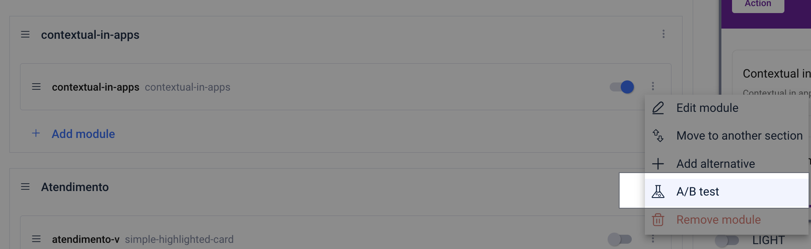
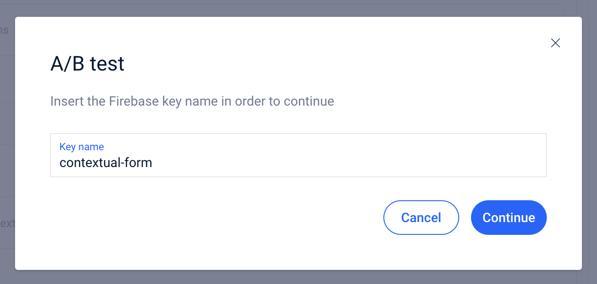
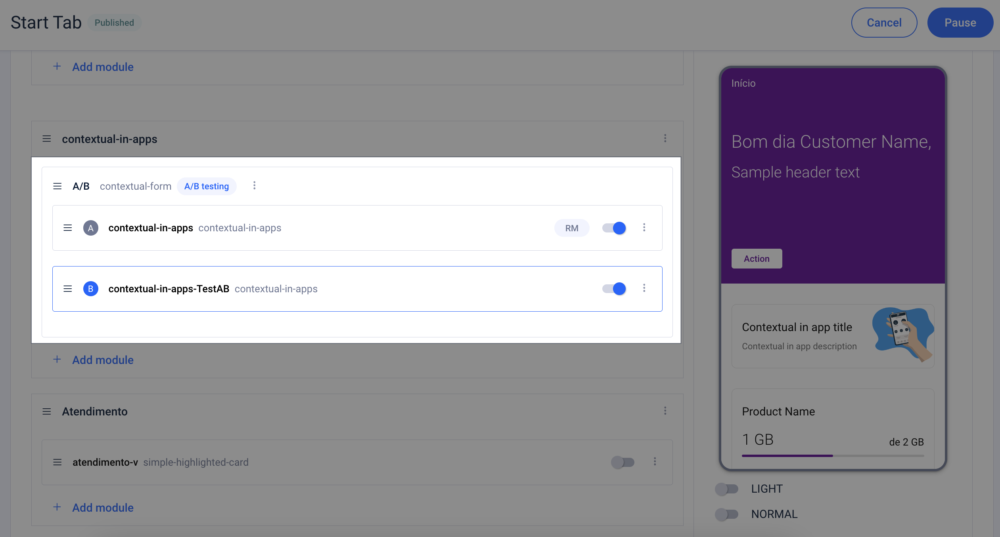

# Como fazer um teste A/B

### Criar um teste A/B

A partir de páginas modulares, é possível realizar um teste A/B para testar como funciona uma mudança em um módulo.

### Antes de começar...

É importante ter em mente que não é possível criar um teste A/B sem coordená-lo com a equipe de Digital Analytics, pois a base de um teste A/B é poder medir os resultados. Para mensurar esses resultados é necessário o uso do Firebase.

### Passos a seguir para criar um teste A/B em páginas modulares

**Passo 1**. Para começar, você precisa ter permissões de criação de teste A/B no CMS. Se você não tiver, entre em contato com o CON para que ele possa entregá-lo a você . Você também pode pedir ajuda ao seu OBPM ou pessoa de referência que você tem na Novum.


Não é uma permissão que você ativou por padrão, então se você nunca a solicitou, é normal que NÃO a tenha. 🙋🏾


**Passo 2**. Acesse as páginas Modulares e edite a página onde deseja colocar aquele Teste.

**Passo 3**. Na etapa **Content**, procure o módulo que deseja testar. Clique no submenu do módulo e selecione a opção **A/B Test**

<figure><figcaption></figcaption></figure>

**Passo 4**. Adicione o nome do teste. O **Key name** é o nome que será usado no Firebase para identificar o teste. Clique em **Continue**.

<figure><figcaption></figcaption></figure>

**Passo 5.** Adicionar o Key name, abre o modo de edição do módulo, exatamente uma réplica do módulo no qual você está fazendo o teste A/B. Faça alterações relacionadas ao teste e clique em **OK**.

<figure><figcaption></figcaption></figure>

Como você pode ver, outro módulo foi criado e agora cada um está identificado com A e B, sendo A o módulo de referência (o módulo fonte, aquele que já está em Produção) e B sendo o módulo a ser testado, também chamado Variant A na ferramenta Firebase.

**Passo 6.** **IMPORTANTE**. As alterações ainda não foram trazidas para o PROD, porque para isso é necessário clicar em **Continue**, no passo **2 Content** onde você está. E finalizar a publicação, no passo 3, de toda a página modular.\\

 **IMPORTANTE** &#x20;

Até que o teste seja lançado no Firebase, o usuário do app continuará vendo o que está em produção, isto é, o módulo de referência, independentemente de o teste já ter sido configurado em Modular pages. Por isso é de vital importância que você se coordene com a equipe de Digital Analytics para saber quando o teste começará a ser exibido. O bom é que você pode deixá-lo pronto no CMS de Modular pages para quando o DA puder ativá-lo no Firebase.

### Passos para marcar a opção vencedora em Modular pages

O teste A/B foi concluído e agora você tem os resultados no Firebase. E agora que?

**Passo 1**. Com os dados analisados ​​e a decisão de qual módulo será o vencedor, acesse o CMS de Modular pages, onde está sendo executado o teste A/B, e edite a página que contém o teste.

<figure><figcaption></figcaption></figure>

**Passo 2**. Clique no submenu do módulo vencedor e selecione **Set as winner**.

<figure><figcaption></figcaption></figure>

\\

**Passo 3.** Uma janela de resumo aparece mostrando o módulo vencedor e uma pré-visualização. Confirme a alteração clicando em **Set as Winner**. Nesse ponto, o módulo descartado é eliminado.

<figure><figcaption></figcaption></figure>

**Passo 4**. **IMPORTANTE**. As alterações ainda não foram trazidas para o PROD, porque para isso é necessário clicar em **Continue**, no passo **2 Content** onde você está.

Já no passo **3 Overview**, clique em **Save and publish**.

Um modo se abre para você indicar uma descrição da alteração que vai fazer. Clique em **Confirm** para finalizar a configuração.

### Boas práticas

É importante que você crie um ticket para a equipe de Digital Analytics descrevendo o teste. Também é importante que você coordene com ela, porque não adianta ter um teste A/B configurado em Modular Pages se esse teste não inicia no Firebase.

[Template Test A/B: \[OB\] Test A/B name](https://confluence.tid.es/pages/viewpage.action?pageId=141016807)\\
