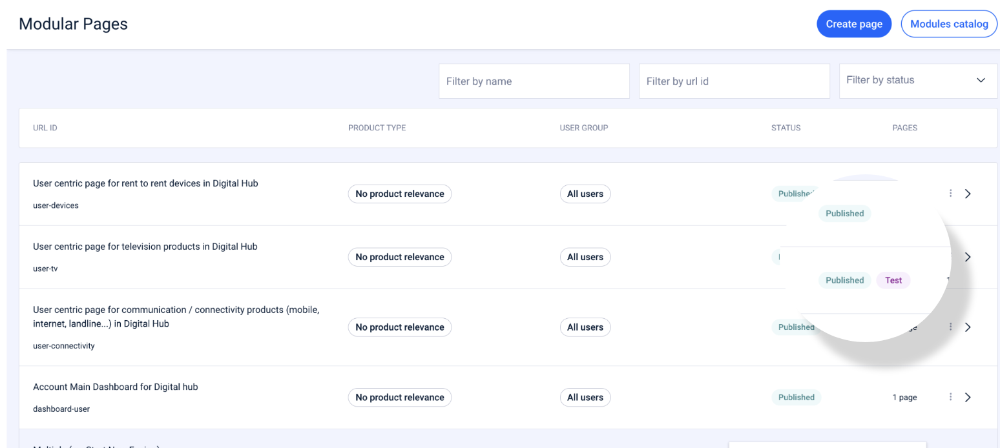
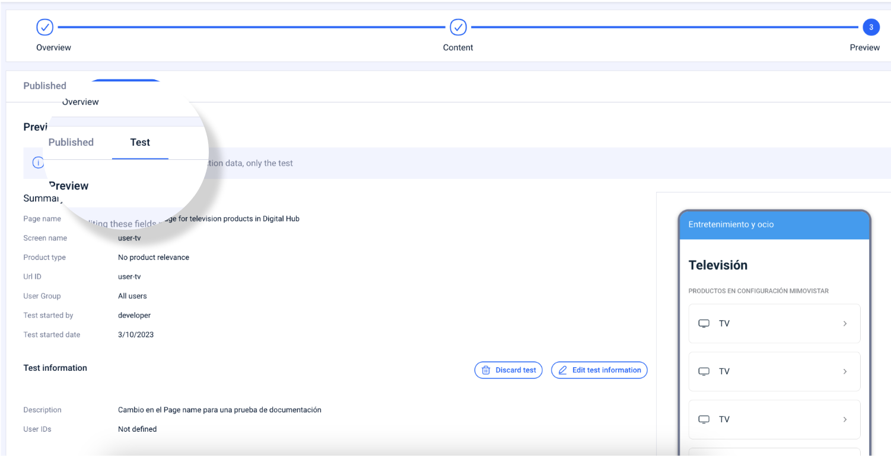
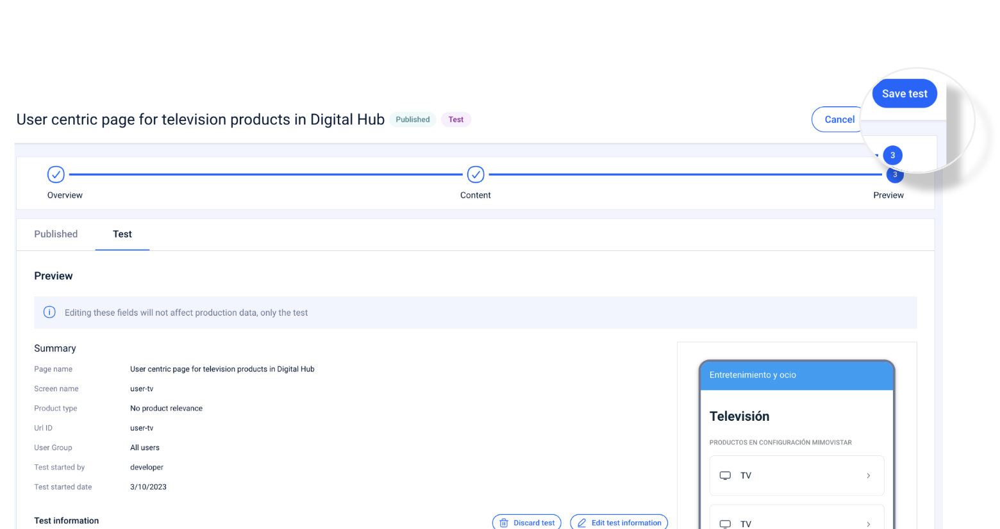
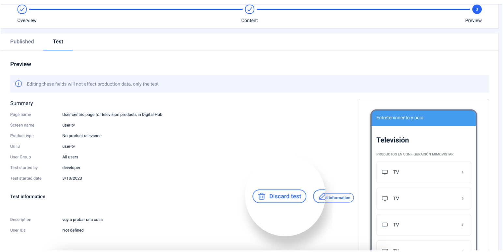
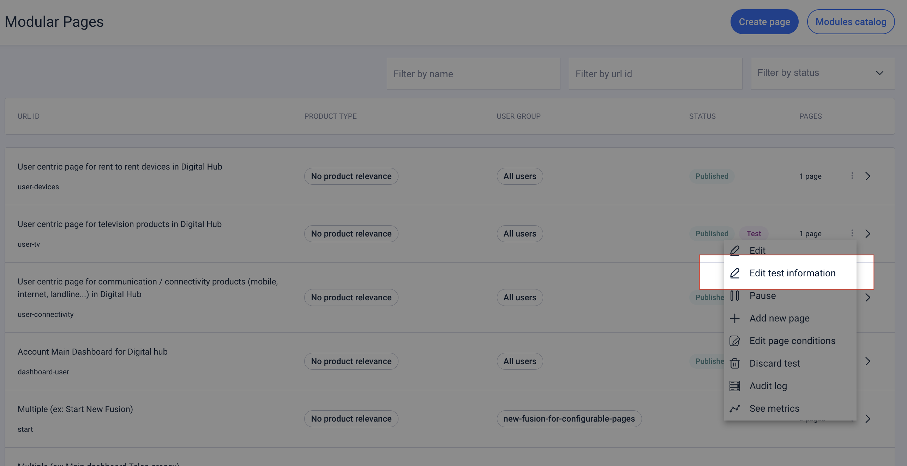

# Como testar o conteúdo

Embora na seção [Vista prévia](broken-reference) você tenha conseguido ver como um teste começa, abaixo você pode aprender mais sobre esse processo de teste de conteúdo:

### Como publicar o conteúdo de um teste

Para começar, você saberá que uma página tem um teste em execução graças à etiqueta de status **TEST**:

<figure><figcaption></figcaption></figure>

Para publicar o conteúdo de um teste, acesse a página em que esse teste está sendo executado.

Ao abrir a página modular, o conteúdo aparece dividido em duas abas para que você possa ver, a todo momento, o conteúdo anterior ao teste e o próprio conteúdo do teste.

👋🏽 O nome da outra aba se refere ao estado em que se encontra o conteúdo que NÃO está em teste.

<figure><figcaption></figcaption></figure>


Você só poderá fazer alterações no conteúdo se estiver na aba \*\*Test\*\*. Use a outra aba para visualizar o conteúdo antes das alterações feitas no teste.


Para **salvar as alterações** feitas em um teste **, mas não publicá-las,** clique em **Save test**:

<figure><figcaption></figcaption></figure>

Quando você tiver certeza de que o conteúdo que tem na aba **Test**, em todas as etapas, é o conteúdo que deseja aplicar, clique em **Save and Publish**. Forneça uma descrição dessas alterações e clique em **Confirm** para validar as alterações e publicar.

Clique em **Close** para retornar à tela principal das páginas modulares.


:thumbsup:Na tela principal, você pode verificar se a etiqueta \*\*TEST\*\* desapareceu do estado da página modular.


### Como eliminar um teste

Se após testar o conteúdo de uma página modular, com um Teste em andamento, você decidir descartar as alterações, acesse a página em que esse teste está em andamento.

Clique em **Continue** até chegar à última etapa de **Preview** e clique em **Discard test**.

<figure><figcaption></figcaption></figure>

Quando você descarta um teste, significa que está eliminando as alterações feitas na página modular. Tanto o conteúdo quanto o estado dessa página permanecem como eram antes do teste.

### Como adicionar, remover ou modificar os Novum user IDs de um teste

Se precisar editar o teste para poder adicionar, remover ou modificar os usuários que podem ver um determinado teste, acesse a página modular que contém o teste.

Na tela principal, onde estão listadas todas as páginas modulares, acesse o menu secundário da página cujos IDs deseja editar, e clique em **Edit test information**.

<figure><figcaption></figcaption></figure>

Você também pode acessar a página e, na última etapa de **Preview,** clicar em **Edit test information**.

Em ambos os casos, você pode adicionar novos IDs de usuário ou excluir o que já existe. Basta editar os valores no campo **User ID (opcional)** e clicar no botão **Edit test information.**
