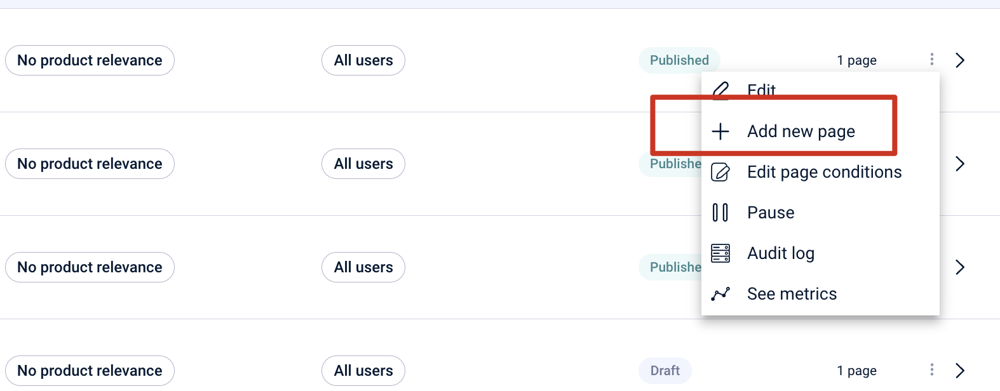
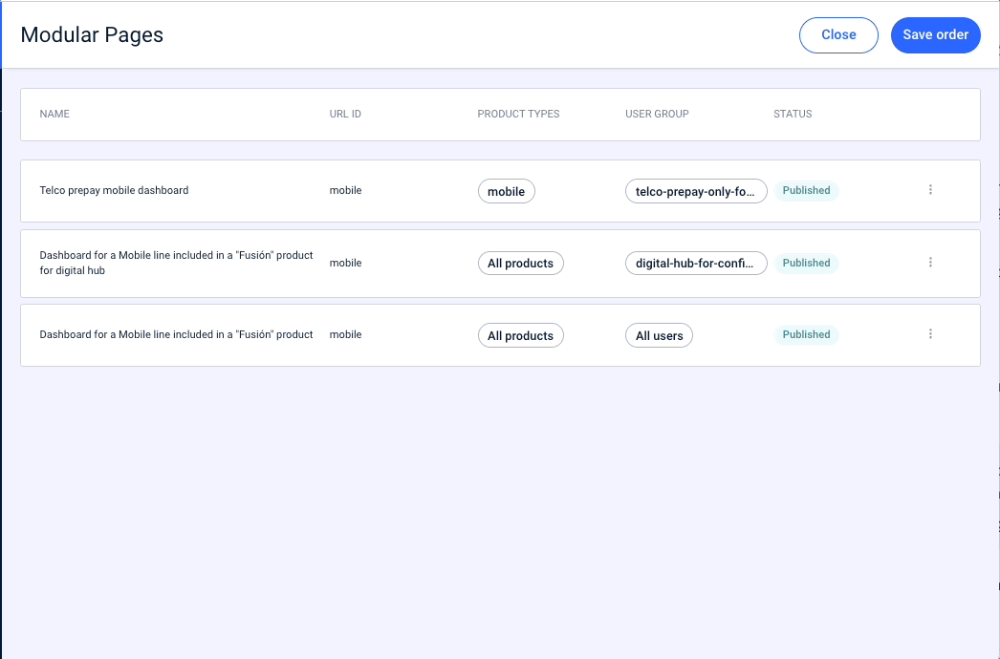

# Criar páginas alternativas

Da mesma forma que é possível configurar [módulos alternativos](como-crear-una-pagina-modular/contenido.md#crear-un-grupo-de-modulos-alternativos), o mesmo acontece com as páginas.

Talvez seja necessário criar a mesma página, mas com uma aparência significativamente diferente, para um grupo de usuários.

Nesse caso, na página que você precisa, na tela de páginas principais, clique em **+Add new page**.

<figure><figcaption></figcaption></figure>

A condição necessária é que você adicione um público para esta nova página, para que faça sentido ter aquela nova “versão” da página para um determinado público.

Exemplo:

*Alice está criando uma página inicial do aplicativo com vários módulos. Mas você sabe que, para um determinado grupo de usuários, aqueles que ainda não têm nome de usuário porque acabaram de se cadastrar no aplicativo, essa página inicial é totalmente diferente.*

*Como Alice faz?*

*Depois que a página inicial for criada com os módulos, cria uma página alternativa indicando que esta página é para usuários com o público `new-user`. Nessa página, inclui um único módulo, que contém apenas o módulo de acesso às perguntas mais frequentes.*

*Desta forma, Alice pode gerenciar muito melhor o conteúdo que outros usuários veem.*

Outro exemplo de utilização muito frequente é quando as páginas estão relacionadas com produtos, caso em que pode ser muito útil, e até necessário, criar páginas alternativas.

*Exemplo*

*Alice precisa criar a página inicial da linha móvel, mas essas páginas estão relacionadas ao produto móvel e são diferentes se o usuário for pré-pago, se o usuário for pós-pago e também tiver um plano contratado, ou se o usuário tiver uma linha pós-paga avulsa.*

*Para isso, Alice cria três páginas alternativas, uma para cada situação, às quais indica os públicos correspondentes e nas quais irá adicionar os módulos que considera.*

### Como classificar páginas alternativas

Para que o sistema avalie qual página exibe ao usuário do aplicativo, ele precisa classificar essas páginas.

 Lembre-se que **o sistema avalia de cima para baixo**, isto é, o primeiro que corresponder ao usuário, começando de cima, será o exibido no app, sem avaliar os seguintes.

Tenha isso em mente ao decidir a ordem em que você colocará essas páginas. 

Mova as páginas com *Drag&amp;Drop* e quando as tiver posicionadas como deseja, clique em **Save order.**

 Você só pode ter uma página que **não contenha públicos** e essa página deve ser sempre **a última**. O sistema avisa se isso não for atendido e você tenta salvar um pedido incorreto. 

<figure><figcaption></figcaption></figure>
